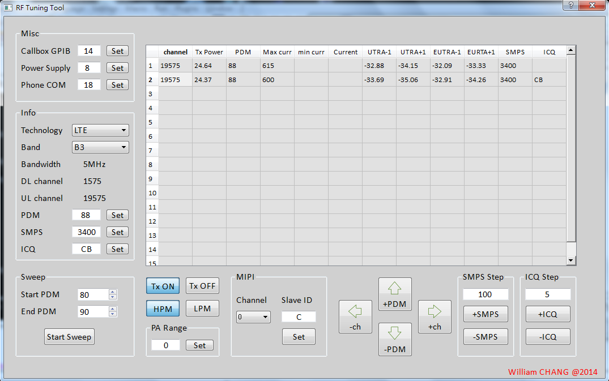

RF_Tuning_Tool
==============

A Python program to facilitate GSM/WCDMA/LTE RF tuning and reduce manual operation.

Introduction
------------

RF tuning contains many manual routine operations, including device setup, 
callbox setup and record measurement result. These routines take lots of 
time and distract RF engineer from tuning itself.

This program contains three classes to wrap callbox and phone commands and 
integrated tuning tools in both command-line and GUI.

Snapshot
------------

File Description
----------------

<table>
	<tr>
		<td>File name</td>
		<td>Function</td>
	</tr>
	<tr>
		<td>RF_Tuning_Tool_2.pyw</td>
		<td>GUI WCDMA/LTE tuning tool</td>
	</tr>
	<tr>
		<td>RF_Tuning_Tool.pyw</td>
		<td>GUI WCDMA/LTE tuning tool (obsolete)</td>
	</tr>
	<tr>
		<td>Agilent8960.py</td>
		<td>Wrap of Agilent8960 GPIB commands</td>
	</tr>
	<tr>
		<td>Anritsu8820C.py</td>
		<td>Wrap of Anritsu8820C GPIB commands</td>
	</tr>
	<tr>
		<td>QCOM.py</td>
		<td>Wrap of Qualcomm QMSL library</td>
	</tr>
	<tr>
		<td>tuning.py</td>
		<td>Command-line WCDMA tuning tool</td>
	</tr>
	<tr>
		<td>tuning_LTE.py</td>
		<td>Command-line LTE tuning tool</td>
	</tr>
	<tr>
		<td>WCDMA_attributes.py</td>
		<td>Parameters including COM port, path loss, etc.</td>
	</tr>
	<tr>
		<td>WCDMA.py</td>
		<td>Link mode auto test tool for TxP/sensitivity</td>
	</tr>
	<tr>
		<td>PS_GW_PPT1830.py</td>
		<td>Warp of Power Supply Good Will PPT-1830</td>
	</tr>
</table>

Supported Device
----------------

- Qualcomm based phone
- Callbox: Anritsu 8820C and Agilent 8960

Requirement
-----------

Hardware
- Qualcomm based device
- Callbox with GPIB (Agilent 8960/ Anritsu 8820C)
- GPIB (tested with NI USB-GPIB adapter)

Software
- Python (tested with 2.7.5, Win7)
- PyVisa (for callbox control)
- PySide (Python binding for QT)
- Qualcomm Library QMSL_MSVC10R (for phone control) [1]
	
[1]: Qualcomm library could be found in QDART

Usage
-----

- Check parameters in WCDMA_attrigutes.py
- Execute RF_Tuning_Tool_2.pyw